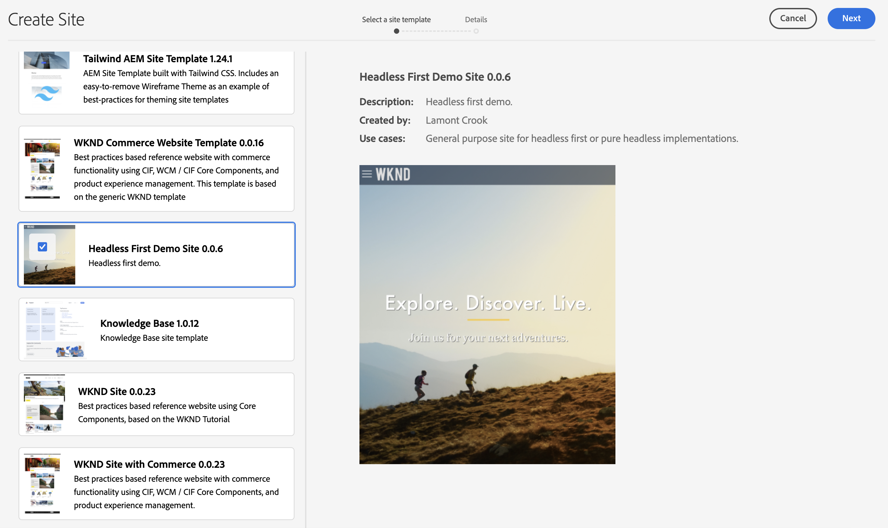

# AEM Pure Headless Demo

## Overview

This demo include pure headless and headful content delivered from Experience Fragments.  The intent of this demo is to show how you would connect an application to AEM using GraphQL and Content Services.  The site can be found [here](https://aem-pure-headless.vercel.app/). It runs independently outside of AEM and can be shared and customized.  

There are 3 possible configurations for this demo.

1. You can use the demo as is from <a href='https://aem-pure-headless.vercel.app/'>this link</a>.  This will be a fully headless site using GraphQL and Experience Fragments from AEM.  You can use the the View GQL button to share the Request and Response from AEM.  This should be used for quick overviews where you simply want a discuss how a site would use AEM headlessly.

2. If you want to customize the content, you can use the Headless First Experience Template found in Reference Demo Addon found inside of a sandbox environment.  

Then proceed to the settings tab in the app and enter the url of your author environment and the name of your project.  Your project name will be the same as the name of the new site you created using the Experience Template.

A short video walking through how to configure can be found [here](https://youtu.be/ZSuPDFAAwj8).

3. If you want to fully customize the demo, you clone the <a href='https://github.com/lamontacrook/aem-pure-headless'>project</a> and build it locally.  This site does not use an .env file for configuration properties.  Instead it uses this setting page for configuration.  Forthcoming video on how to navigate then project.

### Dependencies

This demo out of the box depends on WKND Site being installed and having the name wknd-site.  This can be changed by editing the fragments that contain references to the experience fragments.  Instruction on how to do can be found on the settings tab after authentication.

### Assets & Renditions

Its important that you decide on what renditions you are using.  If you want to use webp renditions then you need to apply the GQL Demo present to all assets in reference demo assets before publishing.  If you would rather use default renditions then within the configuration fragment update the rendition data item to the JSON block below.

``{
  "1280": "cq5dam.web.1280.1280.jpeg",
  "319": "cq5dam.thumbnail.319.319.png",
}``

### Authentication

An authentication token is no longer needed.  Simply make sure that you are running the app in the same browser and in a different be logged into your AEM instance.